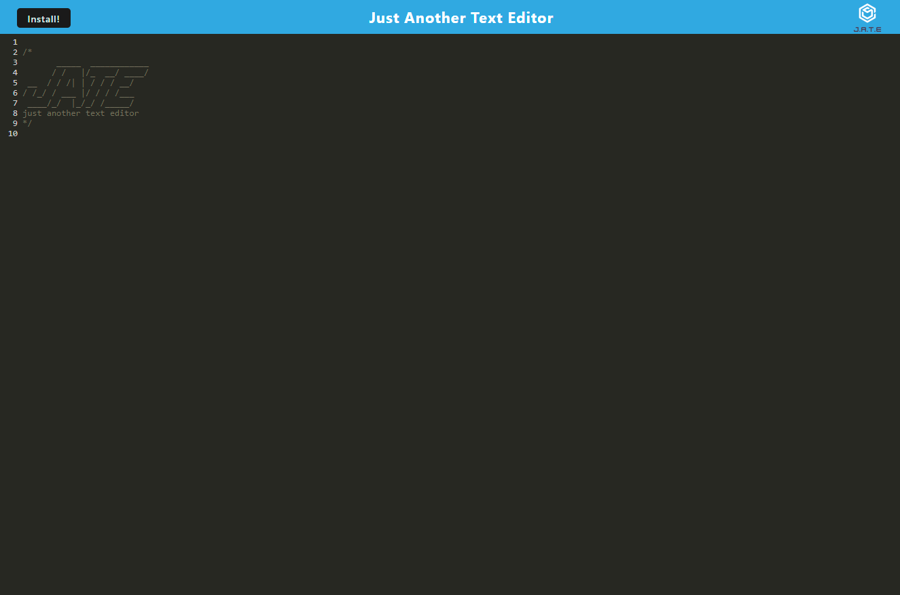

# PWA - Just Another Text Editor  - 
## Description

A simple text editor with javascript syntax highlighting.

### Deployed Application
Click [Here](https://ds-pwa-jate.herokuapp.com/) or on the image below to use the application

## Table of Contents

- [Usage](#usage)
- [License](#license)
- [Technology](#technology)
- [Questions](#questions)

## Usage

### Pre-Deployment

1. Visit the Application [Here](https://ds-pwa-jate.herokuapp.com/)
2. Click into the main editor window and edit your text. 
note: The application will automatically save any edits you make.
3. Click the `install` button in the upper left corner to install the application locally for offline use.

### Local Deployment

If you download the repository and run the server locally:

1. Using a CLI navigate to the folder where you have saved the server.
2. Run command `npm run start` to build the app and start the server.
3. Go to http://localhost:3001 and follow the steps under [Pre-Deployment](#pre-deployment).
## License

MIT License

Copyright 2022 &copy; Daniel Stewart

Permission is hereby granted, free of charge, to any person obtaining a copy of this software and associated documentation files (the "Software"), to deal in the Software without restriction, including without limitation the rights to use, copy, modify, merge, publish, distribute, sublicense, and/or sell copies of the Software, and to permit persons to whom the Software is furnished to do so, subject to the following conditions:

The above copyright notice and this permission notice shall be included in all copies or substantial portions of the Software.

THE SOFTWARE IS PROVIDED "AS IS", WITHOUT WARRANTY OF ANY KIND, EXPRESS OR IMPLIED, INCLUDING BUT NOT LIMITED TO THE WARRANTIES OF MERCHANTABILITY, FITNESS FOR A PARTICULAR PURPOSE AND NONINFRINGEMENT. IN NO EVENT SHALL THE AUTHORS OR COPYRIGHT HOLDERS BE LIABLE FOR ANY CLAIM, DAMAGES OR OTHER LIABILITY, WHETHER IN AN ACTION OF CONTRACT, TORT OR OTHERWISE, ARISING FROM, OUT OF OR IN CONNECTION WITH THE SOFTWARE OR THE USE OR OTHER DEALINGS IN THE SOFTWARE.

## Technology

### Languages

- 

### Runtime

- 

### Packages

- 

- ### Client
- 
- 
- 
- ### Server
- 

### Database

- 

### Development

- 
- 
## Questions 

If you have any questions or feedback you can contact me through one of the links below  
GitHub Profile - [danielstewart914](https://github.com/danielstewart914) 
Email - [danielstewart914@outlook.com](mailto:danielstewart914@outlook.com)
